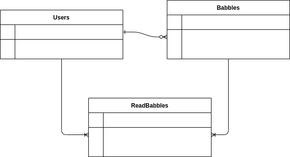

# Babbler

Este es un proyecto con el fin de explorar las capacidades de Ruby on rails. En el se pueden ver features básicos de CRUD y manejo de usuarios.

## tecnologías utilizadas

* **Ruby**: 2.7.0
* **Ruby on Rails**: 6.1.3
* **Postgres**: 13.2

## Diagrama de entidades



## Ambiente de desarrollo

El ambiente de desarrollo utiliza Docker con el fin de emular el ambiente de despleigue y capturar posibles bugs. Es necesario contar con el [ambiente](https://docs.docker.com/get-docker/) y el aroquestador [Docker Compose](https://docs.docker.com/compose/) con el fin de desplegar el proyecto sin necesidad de configuración. Para desplegar el ambiente solo es necesario correr el comando `docker-compose up`.

## Creación e inicialización de la DB

Contando con el ambiente de virtualización, es necesario recurrir a este para poder crear y poblar la base de datos. Para hacerlo se usan los siguientes comandos:

```bash
$ docker-compose run babbler rails db:create
$ docker-compose run babbler rails db:migrate
```

# Autor

* __Alejandro Espinosa__